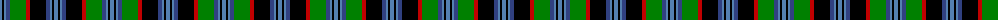

The parent of this is [Unnamed, No 22](/tartans/ba/4/k2/ba2/b4/g16/r4/k16/b4/ba2/k2/ba/4/)

This was sourced from weddslist.  It is a [11 stripes tartan](/stripes/stripes11/).

Original link http://www.weddslist.com/cgi-bin/tartans/pg.pl?source=sts

## Thread count
Ba/4 K2 Ba2 B4 G16 R4 K16 B4 Ba2 K2 Ba/4

## Palette
Each colour and its ΔE from the base-6 reference it is a variant of.

| Colour | Shade | Base | ΔE (OKLab) |
|---|---|---|---|
| B |  `#304080` | B  | 0.01 |
| Ba |  `#5480B0` | B  | 0.20 |
| G |  `#008000` | G  | 0.09 |
| K |  `#000000` | K  | 0.00 |
| R |  `#C00000` | R  | 0.02 |

ID: /variants/ba/4/k2/ba2/b4/g16/r4/k16/b4/ba2/k2/ba/4-b304080-ba5480b0-g008000-k000000-rc00000/
