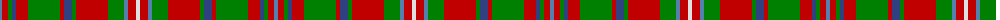

The parent of this is [MacKinnon 6](/tartans/ba/4/r6/g4/b4/r12/g32/r4/b8/g4/r32/g16/ba4/r8/ln/4/)

This was sourced from weddslist.  It is a [14 stripes tartan](/stripes/stripes14/).

Original link http://www.weddslist.com/cgi-bin/tartans/pg.pl?source=sts

## Thread count
Ba/4 R6 G4 B4 R12 G32 R4 B8 G4 R32 G16 Ba4 R8 LN/4

## Palette
Each colour and its ΔE from the base-6 reference it is a variant of.

| Colour | Shade | Base | ΔE (OKLab) |
|---|---|---|---|
| B |  `#304080` | B  | 0.01 |
| Ba |  `#5480B0` | B  | 0.20 |
| G |  `#008000` | G  | 0.09 |
| LN |  `#E0E0E0` | W  | 0.06 |
| R |  `#C00000` | R  | 0.02 |

ID: /variants/ba/4/r6/g4/b4/r12/g32/r4/b8/g4/r32/g16/ba4/r8/ln/4-b304080-ba5480b0-g008000-lne0e0e0-rc00000/
