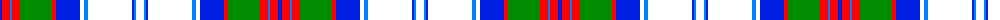

The parent of this is [MacGillivray Dress, Janice](/tartans/ba/4/r8/b2/r8/g32/r4/ba24/w4/b4/w44/ba2/b2/w/8/)

This was sourced from register-of-tartans.  It is a [13 stripes tartan](/stripes/stripes13/).

Original link https://www.tartanregister.gov.uk/tartanDetails.aspx?ref=10811

## Thread count
Ba/4 R8 B2 R8 G32 R4 Ba24 W4 B4 W44 Ba2 B2 W/8

## Palette
Each colour and its ΔE from the base-6 reference it is a variant of.

| Colour | Shade | Base | ΔE (OKLab) |
|---|---|---|---|
| B |  `#007FFF` | B  | 0.24 |
| Ba |  `#001FE2` | B  | 0.16 |
| G |  `#008B00` | G  | 0.12 |
| R |  `#FF0000` | R  | 0.11 |
| W |  `#FFFFFF` | W  | 0.03 |

ID: /variants/ba/4/r8/b2/r8/g32/r4/ba24/w4/b4/w44/ba2/b2/w/8-b007fff-ba001fe2-g008b00-rff0000-wffffff/
