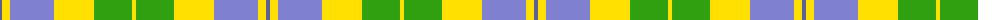

The parent of this is [Barbie's Plaid](/tartans/ba/4/y8/b44/y40/g38/y/4/)

This was sourced from weddslist.  It is a [6 stripes tartan](/stripes/stripes6/).

Original link http://www.weddslist.com/cgi-bin/tartans/pg.pl?source=sts

## Thread count
Ba/4 Y8 B44 Y40 G38 Y/4

## Palette
Each colour and its ΔE from the base-6 reference it is a variant of.

| Colour | Shade | Base | ΔE (OKLab) |
|---|---|---|---|
| B |  `#8080D0` | B  | 0.24 |
| Ba |  `#606090` | B  | 0.12 |
| G |  `#30A010` | G  | 0.19 |
| Y |  `#FFE000` | Y  | 0.09 |

# Sample pattern

ID: /variants/ba/4/y8/b44/y40/g38/y/4-b8080d0-ba606090-g30a010-yffe000/
