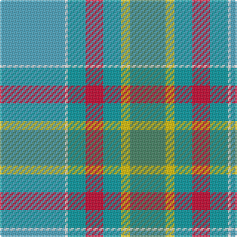

The parent of this is [Dalveen (District)](/tartans/ba/44/w2/b12/r12/b12/y6/g/24/)

This was sourced from tartans-authority.  It is a [7 stripes tartan](/stripes/stripes7/).

Original link http://www.tartansauthority.com/tartan-ferret/display/6657/

## Thread count
Ba/44 W2 B12 R12 B12 Y6 G/24

## Palette
Each colour and its ΔE from the base-6 reference it is a variant of.

| Colour | Shade | Base | ΔE (OKLab) |
|---|---|---|---|
| B |  `#0098A0` | G  | 0.22 |
| Ba |  `#48A4C0` | Y  | 0.28 |
| G |  `#408060` | G  | 0.13 |
| R |  `#C8002C` | R  | 0.03 |
| W |  `#F8F8F8` | W  | 0.01 |
| Y |  `#E8C000` | Y  | 0.00 |

# Sample pattern

ID: /variants/ba/44/w2/b12/r12/b12/y6/g/24-b0098a0-ba48a4c0-g408060-rc8002c-wf8f8f8-ye8c000/
