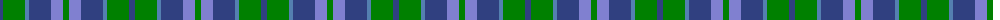

The parent of this is [Unnamed, No 29](/tartans/ba/6/g22/bb4/ba22/b12/g/6/)

This was sourced from weddslist.  It is a [6 stripes tartan](/stripes/stripes6/).

Original link http://www.weddslist.com/cgi-bin/tartans/pg.pl?source=sts

## Thread count
Ba/6 G22 Bb4 Ba22 B12 G/6

## Palette
Each colour and its ΔE from the base-6 reference it is a variant of.

| Colour | Shade | Base | ΔE (OKLab) |
|---|---|---|---|
| B |  `#8080D0` | B  | 0.24 |
| Ba |  `#304080` | B  | 0.01 |
| Bb |  `#5480B0` | B  | 0.20 |
| G |  `#008000` | G  | 0.09 |

# Sample pattern

ID: /variants/ba/6/g22/bb4/ba22/b12/g/6-b8080d0-ba304080-bb5480b0-g008000/
