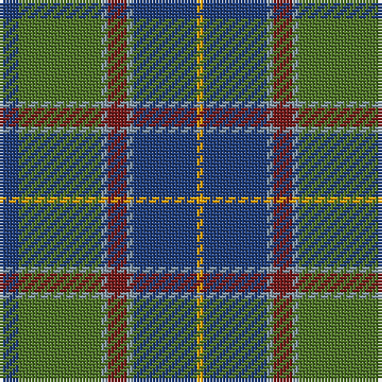

The parent of this is [Graeme Heckenberg Hunting](/tartans/ba/6/g26/b2/dr6/b2/ba20/y/2/)

This was sourced from register-of-tartans.  It is a [7 stripes tartan](/stripes/stripes7/).

Original link https://www.tartanregister.gov.uk/tartanDetails.aspx?ref=10637

## Thread count
Ba/6 G26 B2 DR6 B2 Ba20 Y/2

## Palette
Each colour and its ΔE from the base-6 reference it is a variant of.

| Colour | Shade | Base | ΔE (OKLab) |
|---|---|---|---|
| B |  `#8397A7` | Y  | 0.25 |
| Ba |  `#1F3D7A` | B  | 0.02 |
| DR |  `#761A1A` | R  | 0.17 |
| G |  `#4D7326` | G  | 0.08 |
| Y |  `#FAA706` | Y  | 0.07 |

# Sample pattern

ID: /variants/ba/6/g26/b2/dr6/b2/ba20/y/2-b8397a7-ba1f3d7a-dr761a1a-g4d7326-yfaa706/
