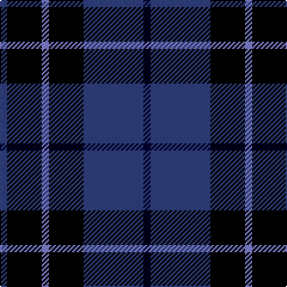

The parent of this is [Scottish Express International](/tartans/ba/6/k29/b6/k29/ba50/db/6/)

This was sourced from weddslist.  It is a [6 stripes tartan](/stripes/stripes6/).

Original link http://www.weddslist.com/cgi-bin/tartans/pg.pl?source=sts

## Thread count
Ba/6 K29 B6 K29 Ba50 DB/6

## Palette
Each colour and its ΔE from the base-6 reference it is a variant of.

| Colour | Shade | Base | ΔE (OKLab) |
|---|---|---|---|
| B |  `#8080D0` | B  | 0.24 |
| Ba |  `#304080` | B  | 0.01 |
| DB |  `#000030` | K  | 0.17 |
| K |  `#000000` | K  | 0.00 |

# Sample pattern

ID: /variants/ba/6/k29/b6/k29/ba50/db/6-b8080d0-ba304080-db000030-k000000/
