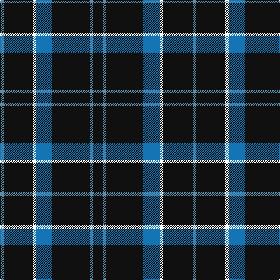

The parent of this is [Cowe (Personal)](/tartans/ba/6/k50/w6/b28/k64/ba6/k/16/)

This was sourced from register-of-tartans.  It is a [7 stripes tartan](/stripes/stripes7/).

Original link https://www.tartanregister.gov.uk/tartanDetails.aspx?ref=782

## Thread count
Ba/6 K50 W6 B28 K64 Ba6 K/16

## Palette
Each colour and its ΔE from the base-6 reference it is a variant of.

| Colour | Shade | Base | ΔE (OKLab) |
|---|---|---|---|
| B |  `#1474B4` | B  | 0.15 |
| Ba |  `#5C8CA8` | B  | 0.23 |
| K |  `#101010` | K  | 0.17 |
| W |  `#FCFCFC` | W  | 0.03 |

# Sample pattern

ID: /variants/ba/6/k50/w6/b28/k64/ba6/k/16-b1474b4-ba5c8ca8-k101010-wfcfcfc/
