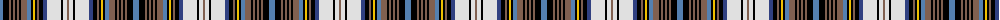

The parent of this is [Unidentified 29](/tartans/ba/6/k6/lt2/k2/lt2/k2/lt2/k2/lt6/ba4/k2/y2/k2/lt2/k4/b4/ln14/k2/ln4/lt/2/)

This was sourced from weddslist.  It is a [20 stripes tartan](/stripes/stripes20/).

Original link http://www.weddslist.com/cgi-bin/tartans/pg.pl?source=sts

## Thread count
Ba/6 K6 LT2 K2 LT2 K2 LT2 K2 LT6 Ba4 K2 Y2 K2 LT2 K4 B4 LN14 K2 LN4 LT/2

## Palette
Each colour and its ΔE from the base-6 reference it is a variant of.

| Colour | Shade | Base | ΔE (OKLab) |
|---|---|---|---|
| B |  `#304080` | B  | 0.01 |
| Ba |  `#5480B0` | B  | 0.20 |
| K |  `#000000` | K  | 0.00 |
| LN |  `#E0E0E0` | W  | 0.06 |
| LT |  `#806050` | R  | 0.17 |
| Y |  `#F0C000` | Y  | 0.01 |

ID: /variants/ba/6/k6/lt2/k2/lt2/k2/lt2/k2/lt6/ba4/k2/y2/k2/lt2/k4/b4/ln14/k2/ln4/lt/2-b304080-ba5480b0-k000000-lne0e0e0-lt806050-yf0c000/
