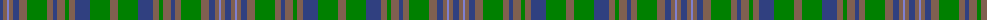

The parent of this is [Unidentified, Fragment](/tartans/ba/6/lt4/b2/lt4/ba6/lt8/g20/lt6/ba4/lt8/g4/lt6/ba15/g20/lt/8/)

This was sourced from weddslist.  It is a [15 stripes tartan](/stripes/stripes15/).

Original link http://www.weddslist.com/cgi-bin/tartans/pg.pl?source=sts

## Thread count
Ba/6 LT4 B2 LT4 Ba6 LT8 G20 LT6 Ba4 LT8 G4 LT6 Ba15 G20 LT/8

## Palette
Each colour and its ΔE from the base-6 reference it is a variant of.

| Colour | Shade | Base | ΔE (OKLab) |
|---|---|---|---|
| B |  `#8080D0` | B  | 0.24 |
| Ba |  `#304080` | B  | 0.01 |
| G |  `#008000` | G  | 0.09 |
| LT |  `#806050` | R  | 0.17 |

ID: /variants/ba/6/lt4/b2/lt4/ba6/lt8/g20/lt6/ba4/lt8/g4/lt6/ba15/g20/lt/8-b8080d0-ba304080-g008000-lt806050/
