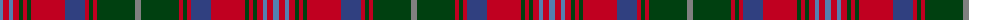

The parent of this is [Manx Heritage](/tartans/ba/6/r6/ba4/r6/dg4/r4/dg4/r34/b20/r4/dg4/r4/dg38/n/6/)

This was sourced from weddslist.  It is a [14 stripes tartan](/stripes/stripes14/).

Original link http://www.weddslist.com/cgi-bin/tartans/pg.pl?source=sts

## Thread count
Ba/6 R6 Ba4 R6 DG4 R4 DG4 R34 B20 R4 DG4 R4 DG38 N/6

## Palette
Each colour and its ΔE from the base-6 reference it is a variant of.

| Colour | Shade | Base | ΔE (OKLab) |
|---|---|---|---|
| B |  `#304080` | B  | 0.01 |
| Ba |  `#5480B0` | B  | 0.20 |
| DG |  `#004010` | G  | 0.12 |
| N |  `#808080` | G  | 0.22 |
| R |  `#C00020` | R  | 0.02 |

ID: /variants/ba/6/r6/ba4/r6/dg4/r4/dg4/r34/b20/r4/dg4/r4/dg38/n/6-b304080-ba5480b0-dg004010-n808080-rc00020/
