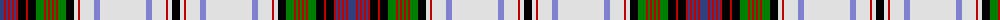

The parent of this is [MacDonald, dress](/tartans/ba/8/r2/ba2/r2/ba2/r2/ba2/r2/k8/r2/k8/g8/r2/g2/r2/g2/r2/g2/r2/g8/k8/ln4/r2/ln14/b6/ln46/b6/ln14/r2/ln4/k/8/)

This was sourced from weddslist.  It is a [31 stripes tartan](/stripes/stripes31/).

Original link http://www.weddslist.com/cgi-bin/tartans/pg.pl?source=sts

## Thread count
Ba/8 R2 Ba2 R2 Ba2 R2 Ba2 R2 K8 R2 K8 G8 R2 G2 R2 G2 R2 G2 R2 G8 K8 LN4 R2 LN14 B6 LN46 B6 LN14 R2 LN4 K/8

## Palette
Each colour and its ΔE from the base-6 reference it is a variant of.

| Colour | Shade | Base | ΔE (OKLab) |
|---|---|---|---|
| B |  `#8080D0` | B  | 0.24 |
| Ba |  `#304080` | B  | 0.01 |
| G |  `#008000` | G  | 0.09 |
| K |  `#000000` | K  | 0.00 |
| LN |  `#E0E0E0` | W  | 0.06 |
| R |  `#C00000` | R  | 0.02 |

ID: /variants/ba/8/r2/ba2/r2/ba2/r2/ba2/r2/k8/r2/k8/g8/r2/g2/r2/g2/r2/g2/r2/g8/k8/ln4/r2/ln14/b6/ln46/b6/ln14/r2/ln4/k/8-b8080d0-ba304080-g008000-k000000-lne0e0e0-rc00000/
