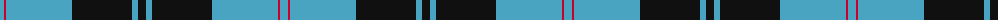
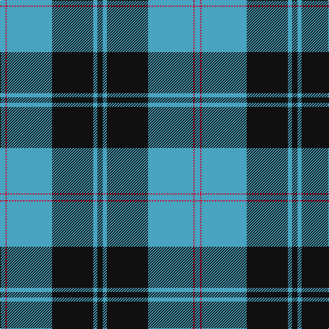

The parent of this is [Intergen (Corporate)](/tartans/ba/8/r2/ba66/k60/b6/k/8/)

This was sourced from tartans-authority.  It is a [6 stripes tartan](/stripes/stripes6/).

Original link http://www.tartansauthority.com/tartan-ferret/display/4092/

## Thread count
Ba/8 R2 Ba66 K60 B6 K/8

## Palette
Each colour and its ΔE from the base-6 reference it is a variant of.

| Colour | Shade | Base | ΔE (OKLab) |
|---|---|---|---|
| B |  `#48A4C0` | Y  | 0.28 |
| Ba |  `#48A4C0` | Y  | 0.28 |
| K |  `#101010` | K  | 0.17 |
| R |  `#C8002C` | R  | 0.03 |

# Sample pattern

ID: /variants/ba/8/r2/ba66/k60/b6/k/8-b48a4c0-ba48a4c0-k101010-rc8002c/
