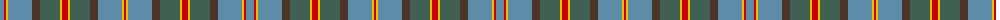

The parent of this is [Hawaiian](/tartans/ba/8/r2/y2/ba24/t8/n20/y2/r6/y2/n20/t8/ba24/y2/r/2/)

This was sourced from register-of-tartans.  It is a [14 stripes tartan](/stripes/stripes14/).

Original link https://www.tartanregister.gov.uk/tartanDetails.aspx?ref=1626

## Thread count
Ba/8 R2 Y2 Ba24 T8 N20 Y2 R6 Y2 N20 T8 Ba24 Y2 R/2

## Palette
Each colour and its ΔE from the base-6 reference it is a variant of.

| Colour | Shade | Base | ΔE (OKLab) |
|---|---|---|---|
| B |  `#1474B4` | B  | 0.15 |
| Ba |  `#5C8CA8` | B  | 0.23 |
| DR |  `#880000` | R  | 0.14 |
| DY |  `#D09800` | Y  | 0.11 |
| N |  `#406054` | G  | 0.11 |
| R |  `#C80000` | R  | 0.00 |
| T |  `#4C3428` | B  | 0.16 |
| Y |  `#E8C000` | Y  | 0.00 |

ID: /variants/ba/8/r2/y2/ba24/t8/n20/y2/r6/y2/n20/t8/ba24/y2/r/2-b1474b4-ba5c8ca8-dr880000-dyd09800-n406054-rc80000-t4c3428-ye8c000/
