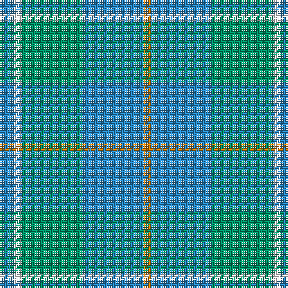

The parent of this is [Bermuda (1986) (Fashion)](/tartans/ba/8/w4/b34/ba34/o/4/)

This was sourced from tartans-authority.  It is a [5 stripes tartan](/stripes/stripes5/).

Original link http://www.tartansauthority.com/tartan-ferret/display/3685/

## Thread count
Ba/8 W4 B34 Ba34 O/4

## Palette
Each colour and its ΔE from the base-6 reference it is a variant of.

| Colour | Shade | Base | ΔE (OKLab) |
|---|---|---|---|
| B |  `#009468` | G  | 0.16 |
| Ba |  `#2888C4` | B  | 0.21 |
| O |  `#D87C00` | Y  | 0.17 |
| W |  `#FCFCFC` | W  | 0.03 |

# Sample pattern

ID: /variants/ba/8/w4/b34/ba34/o/4-b009468-ba2888c4-od87c00-wfcfcfc/
