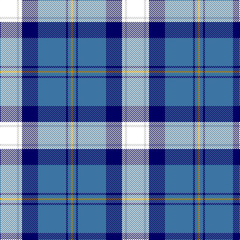

The parent of this is [Banff and Buchan](/tartans/bb/34/n4/bb6/db32/b56/db4/b6/dy/4/)

This was sourced from register-of-tartans.  It is a [8 stripes tartan](/stripes/stripes8/).

Original link https://www.tartanregister.gov.uk/tartanDetails.aspx?ref=190

## Thread count
BB/34 N4 BB6 DB32 B56 DB4 B6 DY/4

## Palette
Each colour and its ΔE from the base-6 reference it is a variant of.

| Colour | Shade | Base | ΔE (OKLab) |
|---|---|---|---|
| B |  `#3C74A4` | B  | 0.15 |
| DB |  `#000064` | B  | 0.17 |
| DY |  `#C48800` | Y  | 0.16 |
| N |  `#C8C8C8` | W  | 0.13 |

# Sample pattern

ID: /variants/bb/34/n4/bb6/db32/b56/db4/b6/dy/4-b3c74a4-db000064-dyc48800-nc8c8c8/
