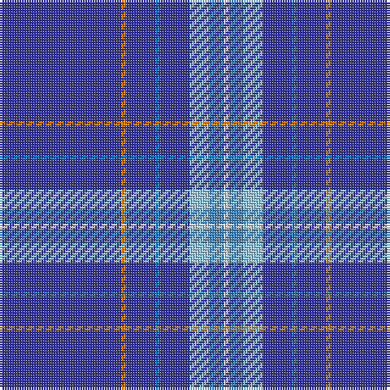

The parent of this is [PSN Test](/tartans/bb/50/o2/bb12/b2/bb12/lb8/ba6/ln/2/)

This was sourced from register-of-tartans.  It is a [8 stripes tartan](/stripes/stripes8/).

Original link https://www.tartanregister.gov.uk/tartanDetails.aspx?ref=3418

## Thread count
Bb/50 O2 Bb12 B2 Bb12 LB8 Ba6 LN/2

## Palette
Each colour and its ΔE from the base-6 reference it is a variant of.

| Colour | Shade | Base | ΔE (OKLab) |
|---|---|---|---|
| B |  `#1474B4` | B  | 0.15 |
| Ba |  `#4888BC` | B  | 0.22 |
| Bb |  `#34349C` | B  | 0.05 |
| LB |  `#98C8E8` | W  | 0.17 |
| LN |  `#E0E0E0` | W  | 0.06 |
| O |  `#D87C00` | Y  | 0.17 |

# Sample pattern

ID: /variants/bb/50/o2/bb12/b2/bb12/lb8/ba6/ln/2-b1474b4-ba4888bc-bb34349c-lb98c8e8-lne0e0e0-od87c00/
