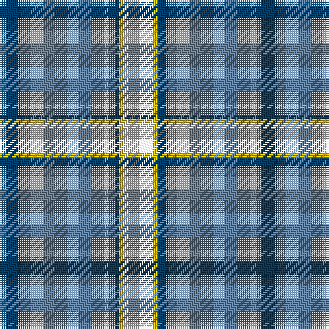

The parent of this is [Herriot Name Tartan Tartan Number: 10128. Earliest known date: 4th January 2010 A tartan for the use of all those who spell their surname as Herriot, a variant spelling of Heriot. See products available Copyright © Blair Urquhart, Comrie, 2015](/tartans/db/10/b40/n3/db5/y2/ln/15/)

This was sourced from house-of-tartan.  It is a [6 stripes tartan](/stripes/stripes6/).

Original link http://www.house-of-tartan.scotland.net/house/TartanViewjs.asp?colr=Def&tnam=10128

## Thread count
DB/10 B40 N3 DB5 Y2 LN/15

## Palette
Each colour and its ΔE from the base-6 reference it is a variant of.

| Colour | Shade | Base | ΔE (OKLab) |
|---|---|---|---|
| B |  `#64809C` | B  | 0.21 |
| DB |  `#003C64` | B  | 0.07 |
| LN |  `#E0E0E0` | W  | 0.06 |
| N |  `#A0A0A0` | Y  | 0.20 |
| Y |  `#E8C000` | Y  | 0.00 |

# Sample pattern

ID: /variants/db/10/b40/n3/db5/y2/ln/15-b64809c-db003c64-lne0e0e0-na0a0a0-ye8c000/
