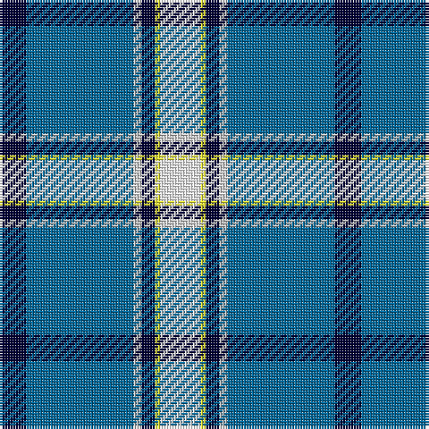

The parent of this is [Herriot New Zealand](/tartans/db/10/b40/n3/db5/y2/w/15/)

This was sourced from register-of-tartans.  It is a [6 stripes tartan](/stripes/stripes6/).

Original link https://www.tartanregister.gov.uk/tartanDetails.aspx?ref=10128

## Thread count
DB/10 B40 N3 DB5 Y2 W/15

## Palette
Each colour and its ΔE from the base-6 reference it is a variant of.

| Colour | Shade | Base | ΔE (OKLab) |
|---|---|---|---|
| B |  `#006699` | B  | 0.11 |
| DB |  `#000033` | K  | 0.18 |
| N |  `#C0C0C0` | W  | 0.16 |
| W |  `#FFFFFF` | W  | 0.03 |
| Y |  `#FFFF33` | Y  | 0.16 |

# Sample pattern

ID: /variants/db/10/b40/n3/db5/y2/w/15-b006699-db000033-nc0c0c0-wffffff-yffff33/
