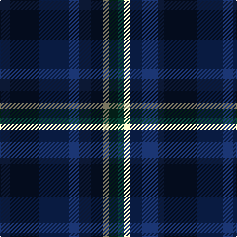

The parent of this is [Craig Devlin (Dundee) (Personal)](/tartans/db/10/dba60/db22/dba12/lr6/dg/16/)

This was sourced from register-of-tartans.  It is a [6 stripes tartan](/stripes/stripes6/).

Original link https://www.tartanregister.gov.uk/tartanDetails.aspx?ref=10514

## Thread count
DB/10 DBa60 DB22 DBa12 LR6 DG/16

## Palette
Each colour and its ΔE from the base-6 reference it is a variant of.

| Colour | Shade | Base | ΔE (OKLab) |
|---|---|---|---|
| DB |  `#172D60` | B  | 0.09 |
| DBa |  `#081736` | B  | 0.19 |
| DG |  `#06392B` | B  | 0.16 |
| LR |  `#DDD5AF` | W  | 0.11 |

# Sample pattern

ID: /variants/db/10/dba60/db22/dba12/lr6/dg/16-db172d60-dba081736-dg06392b-lrddd5af/
