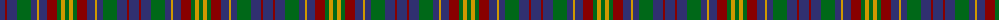

The parent of this is [Mariverain Corporate Tartan Tartan Number: 2327. Earliest known date: pre 2002 Designed by Madelaine Saoie and Noella Vachon - assume that they are French Canadian. No further details at all. Asymmetrical. See products available Copyright © Blair Urquhart, Comrie, 2015](/tartans/db/10/dr2/db10/g14/db6/dy2/db8/dr10/g4/dy4/g/4/)

This was sourced from house-of-tartan.  It is a [11 stripes tartan](/stripes/stripes11/).

Original link http://www.house-of-tartan.scotland.net/house/TartanViewjs.asp?colr=Def&tnam=2327

## Thread count
DB/10 DR2 DB10 G14 DB6 DY2 DB8 DR10 G4 DY4 G/4

## Palette
Each colour and its ΔE from the base-6 reference it is a variant of.

| Colour | Shade | Base | ΔE (OKLab) |
|---|---|---|---|
| DB |  `#303070` | B  | 0.05 |
| DR |  `#880000` | R  | 0.14 |
| DY |  `#D09800` | Y  | 0.11 |
| G |  `#006818` | G  | 0.02 |

ID: /variants/db/10/dr2/db10/g14/db6/dy2/db8/dr10/g4/dy4/g/4-db303070-dr880000-dyd09800-g006818/
