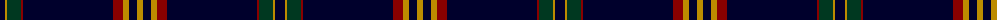

The parent of this is [Brooks Brothers Signature (Corporate](/tartans/db/10/dy2/dg14/dr2/db90/dr10/dy6/db8/dy/6/)

This was sourced from tartans-authority.  It is a [9 stripes tartan](/stripes/stripes9/).

Original link http://www.tartansauthority.com/tartan-ferret/display/10652/

## Thread count
DB/10 DY2 DG14 DR2 DB90 DR10 DY6 DB8 DY/6

## Palette
Each colour and its ΔE from the base-6 reference it is a variant of.

| Colour | Shade | Base | ΔE (OKLab) |
|---|---|---|---|
| DB |  `#00002C` | K  | 0.16 |
| DG |  `#003820` | G  | 0.16 |
| DR |  `#880000` | R  | 0.14 |
| DY |  `#BC8C00` | Y  | 0.16 |

ID: /variants/db/10/dy2/dg14/dr2/db90/dr10/dy6/db8/dy/6-db00002c-dg003820-dr880000-dybc8c00/
