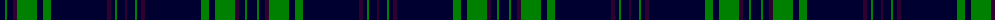

The parent of this is [McCarthy](/tartans/db/10/g2/db6/dp4/g20/db6/g8/db56/dp4/db4/g2/db8/dp/2/)

This was sourced from weddslist.  It is a [13 stripes tartan](/stripes/stripes13/).

Original link http://www.weddslist.com/cgi-bin/tartans/pg.pl?source=sts

## Thread count
DB/10 G2 DB6 DP4 G20 DB6 G8 DB56 DP4 DB4 G2 DB8 DP/2

## Palette
Each colour and its ΔE from the base-6 reference it is a variant of.

| Colour | Shade | Base | ΔE (OKLab) |
|---|---|---|---|
| DB |  `#000030` | K  | 0.17 |
| DP |  `#300030` | B  | 0.21 |
| G |  `#008000` | G  | 0.09 |

ID: /variants/db/10/g2/db6/dp4/g20/db6/g8/db56/dp4/db4/g2/db8/dp/2-db000030-dp300030-g008000/
