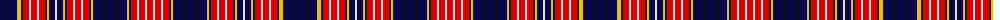

The parent of this is [Ogilvy](/tartans/db/10/k2/db10/y4/k2/r6/ln2/r6/ln2/r6/k2/y2/db6/ln2/db6/y2/k2/r6/ln2/r6/ln2/r6/k2/y2/db10/k2/db10/k2/db10/y2/k2/r6/ln2/r6/ln2/r/6/)

This was sourced from register-of-tartans.  It is a [36 stripes tartan](/stripes/stripes36/).

Original link https://www.tartanregister.gov.uk/tartanDetails.aspx?ref=3235

## Thread count
DB/10 K2 DB10 Y4 K2 R6 LN2 R6 LN2 R6 K2 Y2 DB6 LN2 DB6 Y2 K2 R6 LN2 R6 LN2 R6 K2 Y2 DB10 K2 DB10 K2 DB10 Y2 K2 R6 LN2 R6 LN2 R/6

## Palette
Each colour and its ΔE from the base-6 reference it is a variant of.

| Colour | Shade | Base | ΔE (OKLab) |
|---|---|---|---|
| DB |  `#080848` | B  | 0.19 |
| K |  `#101010` | K  | 0.17 |
| LN |  `#E0E0E0` | W  | 0.06 |
| R |  `#DC0000` | R  | 0.04 |
| Y |  `#E8C000` | Y  | 0.00 |

ID: /variants/db/10/k2/db10/y4/k2/r6/ln2/r6/ln2/r6/k2/y2/db6/ln2/db6/y2/k2/r6/ln2/r6/ln2/r6/k2/y2/db10/k2/db10/k2/db10/y2/k2/r6/ln2/r6/ln2/r/6-db080848-k101010-lne0e0e0-rdc0000-ye8c000/
