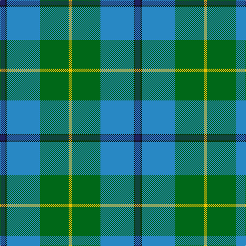

The parent of this is [Phoenix Police Honor Guard (Corp.)](/tartans/db/10/k3/b65/g56/y/6/)

This was sourced from tartans-authority.  It is a [5 stripes tartan](/stripes/stripes5/).

Original link http://www.tartansauthority.com/tartan-ferret/display/10334/

## Thread count
DB/10 K3 B65 G56 Y/6

## Palette
Each colour and its ΔE from the base-6 reference it is a variant of.

| Colour | Shade | Base | ΔE (OKLab) |
|---|---|---|---|
| B |  `#2888C4` | B  | 0.21 |
| DB |  `#202060` | B  | 0.11 |
| G |  `#006818` | G  | 0.02 |
| K |  `#101010` | K  | 0.17 |
| Y |  `#E8C000` | Y  | 0.00 |

# Sample pattern

ID: /variants/db/10/k3/b65/g56/y/6-b2888c4-db202060-g006818-k101010-ye8c000/
