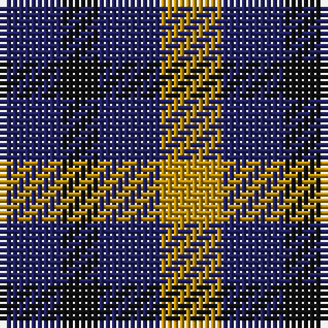

The parent of this is [Kazakhstan Relic](/tartans/db/10/k6/db10/dy/10/)

This was sourced from register-of-tartans.  It is a [4 stripes tartan](/stripes/stripes4/).

Original link https://www.tartanregister.gov.uk/tartanDetails.aspx?ref=5137

## Thread count
DB/10 K6 DB10 DY/10

## Palette
Each colour and its ΔE from the base-6 reference it is a variant of.

| Colour | Shade | Base | ΔE (OKLab) |
|---|---|---|---|
| DB |  `#202060` | B  | 0.11 |
| DY |  `#BC8C00` | Y  | 0.16 |
| K |  `#101010` | K  | 0.17 |

# Sample pattern

ID: /variants/db/10/k6/db10/dy/10-db202060-dybc8c00-k101010/
