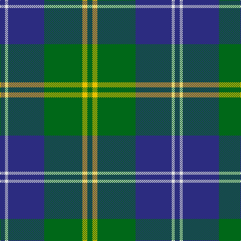

The parent of this is [St. Andrew Society, Sao Paulo (Corp)](/tartans/db/10/ln6/db72/g76/y10/g/10/)

This was sourced from tartans-authority.  It is a [6 stripes tartan](/stripes/stripes6/).

Original link http://www.tartansauthority.com/tartan-ferret/display/8121/

## Thread count
DB/10 LN6 DB72 G76 Y10 G/10

## Palette
Each colour and its ΔE from the base-6 reference it is a variant of.

| Colour | Shade | Base | ΔE (OKLab) |
|---|---|---|---|
| DB |  `#2C2C80` | B  | 0.05 |
| G |  `#006818` | G  | 0.02 |
| LN |  `#E0E0E0` | W  | 0.06 |
| Y |  `#E8C000` | Y  | 0.00 |

# Sample pattern

ID: /variants/db/10/ln6/db72/g76/y10/g/10-db2c2c80-g006818-lne0e0e0-ye8c000/
