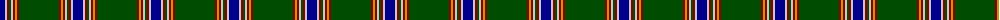

The parent of this is [Scotts Valley (Corporate)](/tartans/db/10/n2/dr2/g2/n2/dr2/dy2/dr2/g/40/)

This was sourced from tartans-authority.  It is a [9 stripes tartan](/stripes/stripes9/).

Original link http://www.tartansauthority.com/tartan-ferret/display/5350/

## Thread count
DB/10 N2 DR2 G2 N2 DR2 DY2 DR2 G/40

## Palette
Each colour and its ΔE from the base-6 reference it is a variant of.

| Colour | Shade | Base | ΔE (OKLab) |
|---|---|---|---|
| DB |  `#00008C` | B  | 0.13 |
| DR |  `#8C0000` | R  | 0.13 |
| DY |  `#C89800` | Y  | 0.12 |
| G |  `#004C00` | G  | 0.08 |
| N |  `#C8C8C8` | W  | 0.13 |

ID: /variants/db/10/n2/dr2/g2/n2/dr2/dy2/dr2/g/40-db00008c-dr8c0000-dyc89800-g004c00-nc8c8c8/
