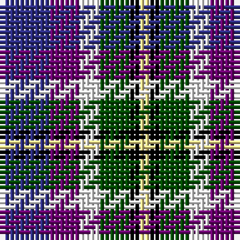

The parent of this is [MacBlain (2016)](/tartans/db/10/p6/w4/g6/k2/ly/2/)

This was sourced from register-of-tartans.  It is a [6 stripes tartan](/stripes/stripes6/).

Original link https://www.tartanregister.gov.uk/tartanDetails.aspx?ref=11540

## Thread count
DB/10 P6 W4 G6 K2 LY/2

## Palette
Each colour and its ΔE from the base-6 reference it is a variant of.

| Colour | Shade | Base | ΔE (OKLab) |
|---|---|---|---|
| DB |  `#2C2C80` | B  | 0.05 |
| G |  `#004C00` | G  | 0.08 |
| K |  `#000000` | K  | 0.00 |
| LY |  `#F8E38C` | Y  | 0.11 |
| P |  `#6C0070` | B  | 0.15 |
| W |  `#F8F8F8` | W  | 0.01 |

# Sample pattern

ID: /variants/db/10/p6/w4/g6/k2/ly/2-db2c2c80-g004c00-k000000-lyf8e38c-p6c0070-wf8f8f8/
