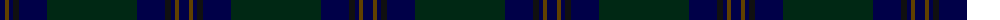

The parent of this is [St Andrews Old Course Hotel, Golf Course and Spa](/tartans/db/10/t4/db4/k6/db28/dg/90/)

This was sourced from register-of-tartans.  It is a [6 stripes tartan](/stripes/stripes6/).

Original link https://www.tartanregister.gov.uk/tartanDetails.aspx?ref=3883

## Thread count
DB/10 T4 DB4 K6 DB28 DG/90

## Palette
Each colour and its ΔE from the base-6 reference it is a variant of.

| Colour | Shade | Base | ΔE (OKLab) |
|---|---|---|---|
| DB |  `#000048` | B  | 0.21 |
| DG |  `#002814` | B  | 0.21 |
| DGa |  `#003820` | G  | 0.16 |
| K |  `#101010` | K  | 0.17 |
| T |  `#604000` | G  | 0.14 |

# Sample pattern

ID: /variants/db/10/t4/db4/k6/db28/dg/90-db000048-dg002814-dga003820-k101010-t604000/
