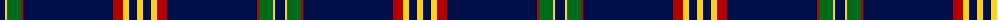

The parent of this is [Brooks Brothers Signature](/tartans/db/10/y2/g14/dr2/db90/dr10/y6/db8/y/6/)

This was sourced from register-of-tartans.  It is a [9 stripes tartan](/stripes/stripes9/).

Original link https://www.tartanregister.gov.uk/tartanDetails.aspx?ref=10652

## Thread count
DB/10 Y2 G14 DR2 DB90 DR10 Y6 DB8 Y/6

## Palette
Each colour and its ΔE from the base-6 reference it is a variant of.

| Colour | Shade | Base | ΔE (OKLab) |
|---|---|---|---|
| DB |  `#000E48` | B  | 0.19 |
| DR |  `#B30000` | R  | 0.04 |
| G |  `#006B1B` | G  | 0.02 |
| Y |  `#FFD014` | Y  | 0.06 |

ID: /variants/db/10/y2/g14/dr2/db90/dr10/y6/db8/y/6-db000e48-drb30000-g006b1b-yffd014/
