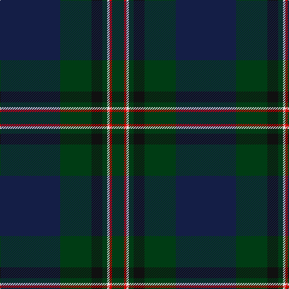

The parent of this is [Java St Andrew Society hunting](/tartans/db/100/dg52/k18/dg8/ln4/r4/dg/20/)

This was sourced from register-of-tartans.  It is a [7 stripes tartan](/stripes/stripes7/).

Original link https://www.tartanregister.gov.uk/tartanDetails.aspx?ref=5449

## Thread count
DB/100 DG52 K18 DG8 LN4 R4 DG/20

## Palette
Each colour and its ΔE from the base-6 reference it is a variant of.

| Colour | Shade | Base | ΔE (OKLab) |
|---|---|---|---|
| DB |  `#141E46` | B  | 0.15 |
| DG |  `#003C14` | G  | 0.14 |
| K |  `#101010` | K  | 0.17 |
| LN |  `#E0E0E0` | W  | 0.06 |
| R |  `#DC0000` | R  | 0.04 |

# Sample pattern

ID: /variants/db/100/dg52/k18/dg8/ln4/r4/dg/20-db141e46-dg003c14-k101010-lne0e0e0-rdc0000/
