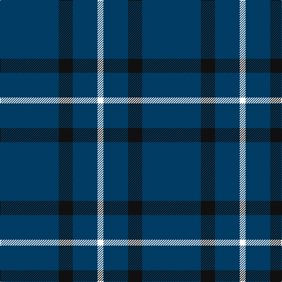

The parent of this is [Coinean Dubh](/tartans/db/100/k24/db42/w/10/)

This was sourced from register-of-tartans.  It is a [4 stripes tartan](/stripes/stripes4/).

Original link https://www.tartanregister.gov.uk/tartanDetails.aspx?ref=11506

## Thread count
DB/100 K24 DB42 W/10

## Palette
Each colour and its ΔE from the base-6 reference it is a variant of.

| Colour | Shade | Base | ΔE (OKLab) |
|---|---|---|---|
| DB |  `#003C64` | B  | 0.07 |
| K |  `#101010` | K  | 0.17 |
| W |  `#FFFFFF` | W  | 0.03 |

# Sample pattern

ID: /variants/db/100/k24/db42/w/10-db003c64-k101010-wffffff/
