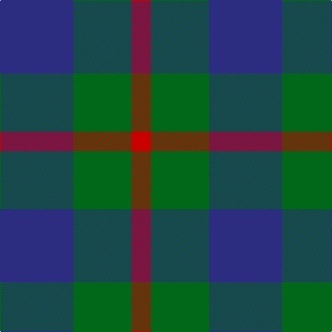

The parent of this is [Agnew (Clan)](/tartans/db/106/g84/r/28/)

This was sourced from tartans-authority.  It is a [3 stripes tartan](/stripes/stripes3/).

Original link http://www.tartansauthority.com/tartan-ferret/display/182/

## Thread count
DB/106 G84 R/28

## Palette
Each colour and its ΔE from the base-6 reference it is a variant of.

| Colour | Shade | Base | ΔE (OKLab) |
|---|---|---|---|
| DB |  `#2C2C80` | B  | 0.05 |
| G |  `#006818` | G  | 0.02 |
| R |  `#C80000` | R  | 0.00 |

# Sample pattern

ID: /variants/db/106/g84/r/28-db2c2c80-g006818-rc80000/
