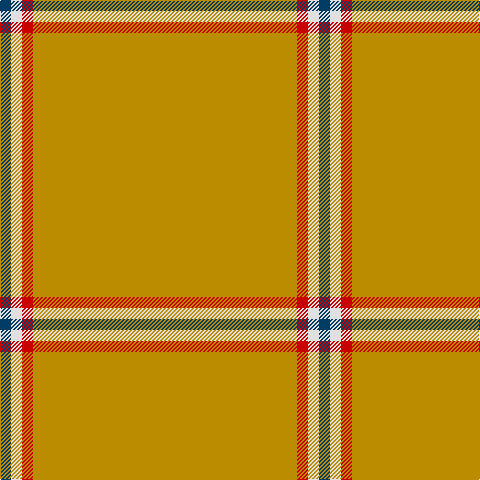

The parent of this is [Dutch Football (Corporate)](/tartans/db/11/ln11/r11/dy/264/)

This was sourced from tartans-authority.  It is a [4 stripes tartan](/stripes/stripes4/).

Original link http://www.tartansauthority.com/tartan-ferret/display/8022/

## Thread count
DB/11 LN11 R11 DY/264

## Palette
Each colour and its ΔE from the base-6 reference it is a variant of.

| Colour | Shade | Base | ΔE (OKLab) |
|---|---|---|---|
| DB |  `#003C64` | B  | 0.07 |
| DY |  `#BC8C00` | Y  | 0.16 |
| LN |  `#E0E0E0` | W  | 0.06 |
| R |  `#C80000` | R  | 0.00 |

# Sample pattern

ID: /variants/db/11/ln11/r11/dy/264-db003c64-dybc8c00-lne0e0e0-rc80000/
