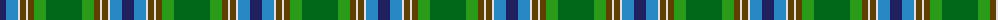

The parent of this is [Iroquois Falls Centenary (Commem.)](/tartans/db/12/b12/ln2/t6/ln2/t6/g12/ga/36/)

This was sourced from tartans-authority.  It is a [8 stripes tartan](/stripes/stripes8/).

Original link http://www.tartansauthority.com/tartan-ferret/display/10574/

## Thread count
DB/12 B12 LN2 T6 LN2 T6 G12 Ga/36

## Palette
Each colour and its ΔE from the base-6 reference it is a variant of.

| Colour | Shade | Base | ΔE (OKLab) |
|---|---|---|---|
| B |  `#2888C4` | B  | 0.21 |
| DB |  `#202060` | B  | 0.11 |
| G |  `#289C18` | G  | 0.18 |
| Ga |  `#006818` | G  | 0.02 |
| LN |  `#E0E0E0` | W  | 0.06 |
| T |  `#604000` | G  | 0.14 |

# Sample pattern

ID: /variants/db/12/b12/ln2/t6/ln2/t6/g12/ga/36-b2888c4-db202060-g289c18-ga006818-lne0e0e0-t604000/
