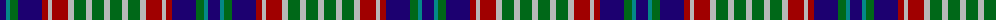

The parent of this is [Rainbow (Canada)](/tartans/db/12/b4/g8/db24/dr6/n4/dr16/n6/g12/n6/g12/n/6/)

This was sourced from register-of-tartans.  It is a [12 stripes tartan](/stripes/stripes12/).

Original link https://www.tartanregister.gov.uk/tartanDetails.aspx?ref=3443

## Thread count
DB/12 B4 G8 DB24 DR6 N4 DR16 N6 G12 N6 G12 N/6

## Palette
Each colour and its ΔE from the base-6 reference it is a variant of.

| Colour | Shade | Base | ΔE (OKLab) |
|---|---|---|---|
| B |  `#048888` | G  | 0.18 |
| DB |  `#1C0070` | B  | 0.14 |
| DR |  `#A00000` | R  | 0.09 |
| G |  `#006818` | G  | 0.02 |
| N |  `#B8B8B8` | Y  | 0.17 |

ID: /variants/db/12/b4/g8/db24/dr6/n4/dr16/n6/g12/n6/g12/n/6-b048888-db1c0070-dra00000-g006818-nb8b8b8/
