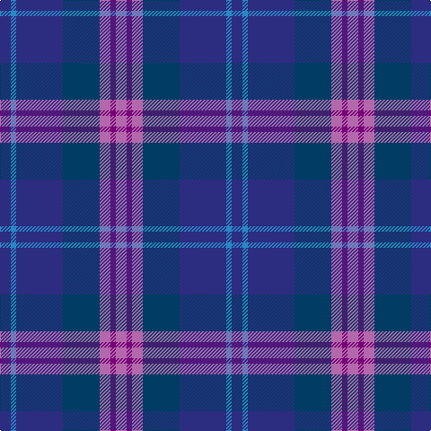

The parent of this is [Great Scot (Fashion) Fashion Tartan Tartan Number: 6106. Earliest known date: Jan 2004 Fashion tartan from Marton Mills of Yorkshire launched at the 2004 International Gift Fair in Glasgow. "Designed as a modern multi-purpose tartan that can be worn with pride on any occasion." See products available Copyright © Blair Urquhart, Comrie, 2015](/tartans/db/12/ba6/db52/dba41/pa12/p6/pa/12/)

This was sourced from house-of-tartan.  It is a [7 stripes tartan](/stripes/stripes7/).

Original link http://www.house-of-tartan.scotland.net/house/TartanViewjs.asp?colr=Def&tnam=6106

## Thread count
DB/12 Ba6 DB52 DBa41 Pa12 P6 Pa/12

## Palette
Each colour and its ΔE from the base-6 reference it is a variant of.

| Colour | Shade | Base | ΔE (OKLab) |
|---|---|---|---|
| B |  `#1474B4` | B  | 0.15 |
| Ba |  `#2888C4` | B  | 0.21 |
| DB |  `#2C2C80` | B  | 0.05 |
| DBa |  `#003C64` | B  | 0.07 |
| P |  `#780078` | B  | 0.16 |
| Pa |  `#B468AC` | R  | 0.21 |

# Sample pattern

ID: /variants/db/12/ba6/db52/dba41/pa12/p6/pa/12-b1474b4-ba2888c4-db2c2c80-dba003c64-p780078-pab468ac/
