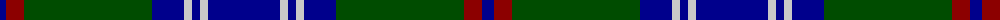

The parent of this is [Colvin (Name)](/tartans/db/12/dr18/g128/db32/n8/db8/n8/db/72/)

This was sourced from tartans-authority.  It is a [8 stripes tartan](/stripes/stripes8/).

Original link http://www.tartansauthority.com/tartan-ferret/display/4196/

## Thread count
DB/12 DR18 G128 DB32 N8 DB8 N8 DB/72

## Palette
Each colour and its ΔE from the base-6 reference it is a variant of.

| Colour | Shade | Base | ΔE (OKLab) |
|---|---|---|---|
| DB |  `#00008C` | B  | 0.13 |
| DR |  `#8C0000` | R  | 0.13 |
| G |  `#004C00` | G  | 0.08 |
| N |  `#C8C8C8` | W  | 0.13 |

# Sample pattern

ID: /variants/db/12/dr18/g128/db32/n8/db8/n8/db/72-db00008c-dr8c0000-g004c00-nc8c8c8/
