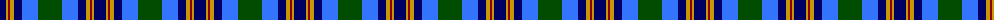
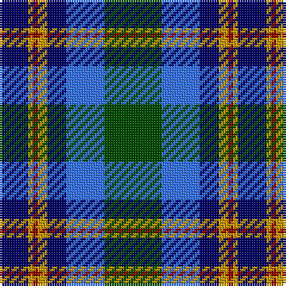

The parent of this is [F.I.A.T.A. Congress 1990 (Corporate)](/tartans/db/12/dy2/dr2/dy4/db8/b16/g/24/)

This was sourced from tartans-authority.  It is a [7 stripes tartan](/stripes/stripes7/).

Original link http://www.tartansauthority.com/tartan-ferret/display/4832/

## Thread count
DB/12 DY2 DR2 DY4 DB8 B16 G/24

## Palette
Each colour and its ΔE from the base-6 reference it is a variant of.

| Colour | Shade | Base | ΔE (OKLab) |
|---|---|---|---|
| B |  `#3474FC` | B  | 0.23 |
| DB |  `#000064` | B  | 0.17 |
| DR |  `#8C0000` | R  | 0.13 |
| DY |  `#C89800` | Y  | 0.12 |
| G |  `#004C00` | G  | 0.08 |

# Sample pattern

ID: /variants/db/12/dy2/dr2/dy4/db8/b16/g/24-b3474fc-db000064-dr8c0000-dyc89800-g004c00/
