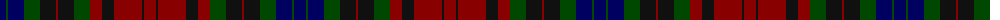

The parent of this is [Forbes (Pendleton-1)](/tartans/db/12/g2/db16/g16/k16/dr2/k16/g16/dr12/k12/dr28/k2/dr/12/)

This was sourced from register-of-tartans.  It is a [13 stripes tartan](/stripes/stripes13/).

Original link https://www.tartanregister.gov.uk/tartanDetails.aspx?ref=1221

## Thread count
DB/12 G2 DB16 G16 K16 DR2 K16 G16 DR12 K12 DR28 K2 DR/12

## Palette
Each colour and its ΔE from the base-6 reference it is a variant of.

| Colour | Shade | Base | ΔE (OKLab) |
|---|---|---|---|
| DB |  `#000060` | B  | 0.18 |
| DR |  `#880000` | R  | 0.14 |
| G |  `#004800` | G  | 0.09 |
| K |  `#101010` | K  | 0.17 |

ID: /variants/db/12/g2/db16/g16/k16/dr2/k16/g16/dr12/k12/dr28/k2/dr/12-db000060-dr880000-g004800-k101010/
