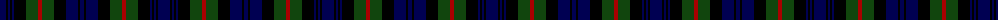

The parent of this is [Murray](/tartans/db/12/k2/db2/k2/db2/k12/dg12/dr4/dg12/k12/db12/k2/db/4/)

This was sourced from weddslist.  It is a [13 stripes tartan](/stripes/stripes13/).

Original link http://www.weddslist.com/cgi-bin/tartans/pg.pl?source=x

## Thread count
DB/12 K2 DB2 K2 DB2 K12 DG12 DR4 DG12 K12 DB12 K2 DB/4

## Palette
Each colour and its ΔE from the base-6 reference it is a variant of.

| Colour | Shade | Base | ΔE (OKLab) |
|---|---|---|---|
| DB |  `#000052` | B  | 0.20 |
| DG |  `#11450D` | G  | 0.10 |
| DR |  `#AA0000` | R  | 0.06 |
| K |  `#000000` | K  | 0.00 |

ID: /variants/db/12/k2/db2/k2/db2/k12/dg12/dr4/dg12/k12/db12/k2/db/4-db000052-dg11450d-draa0000-k000000/
