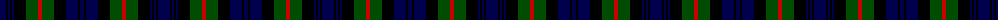

The parent of this is [Murray](/tartans/db/12/k2/db2/k2/db2/k12/g12/r4/g12/k12/db12/k2/db/4/)

This was sourced from weddslist.  It is a [13 stripes tartan](/stripes/stripes13/).

Original link http://www.weddslist.com/cgi-bin/tartans/pg.pl?source=rb

## Thread count
DB/12 K2 DB2 K2 DB2 K12 G12 R4 G12 K12 DB12 K2 DB/4

## Palette
Each colour and its ΔE from the base-6 reference it is a variant of.

| Colour | Shade | Base | ΔE (OKLab) |
|---|---|---|---|
| DB |  `#00004C` | B  | 0.21 |
| G |  `#004C00` | G  | 0.08 |
| K |  `#000000` | K  | 0.00 |
| R |  `#C80000` | R  | 0.00 |

ID: /variants/db/12/k2/db2/k2/db2/k12/g12/r4/g12/k12/db12/k2/db/4-db00004c-g004c00-k000000-rc80000/
