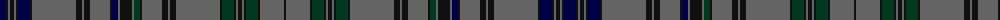

The parent of this is [Weiss-Halliwell (Personal)](/tartans/db/12/k2/n2/k4/n2/k2/db12/k2/n44/k6/n2/k6/n20/k2/db6/n2/k12/n2/dg6/k2/n20/k6/n2/k6/n44/k2/dg12/k2/n2/k4/n2/k2/dg12/k2/n24/k/2/)

This was sourced from register-of-tartans.  It is a [36 stripes tartan](/stripes/stripes36/).

Original link https://www.tartanregister.gov.uk/tartanDetails.aspx?ref=11055

## Thread count
DB/12 K2 N2 K4 N2 K2 DB12 K2 N44 K6 N2 K6 N20 K2 DB6 N2 K12 N2 DG6 K2 N20 K6 N2 K6 N44 K2 DG12 K2 N2 K4 N2 K2 DG12 K2 N24 K/2

## Palette
Each colour and its ΔE from the base-6 reference it is a variant of.

| Colour | Shade | Base | ΔE (OKLab) |
|---|---|---|---|
| DB |  `#000048` | B  | 0.21 |
| DG |  `#003820` | G  | 0.16 |
| K |  `#101010` | K  | 0.17 |
| N |  `#646464` | B  | 0.16 |

ID: /variants/db/12/k2/n2/k4/n2/k2/db12/k2/n44/k6/n2/k6/n20/k2/db6/n2/k12/n2/dg6/k2/n20/k6/n2/k6/n44/k2/dg12/k2/n2/k4/n2/k2/dg12/k2/n24/k/2-db000048-dg003820-k101010-n646464/
