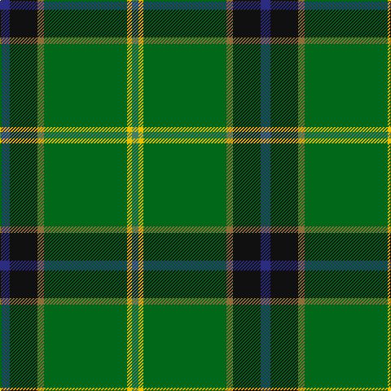

The parent of this is [U.S. Army (Military)](/tartans/db/12/k34/lt8/ga102/y6/g/8/)

This was sourced from tartans-authority.  It is a [6 stripes tartan](/stripes/stripes6/).

Original link http://www.tartansauthority.com/tartan-ferret/display/6307/

## Thread count
DB/12 K34 LT8 Ga102 Y6 G/8

## Palette
Each colour and its ΔE from the base-6 reference it is a variant of.

| Colour | Shade | Base | ΔE (OKLab) |
|---|---|---|---|
| DB |  `#2C2C80` | B  | 0.05 |
| G |  `#408060` | G  | 0.13 |
| Ga |  `#006818` | G  | 0.02 |
| K |  `#101010` | K  | 0.17 |
| LT |  `#8C7038` | G  | 0.18 |
| Y |  `#E8C000` | Y  | 0.00 |

# Sample pattern

ID: /variants/db/12/k34/lt8/ga102/y6/g/8-db2c2c80-g408060-ga006818-k101010-lt8c7038-ye8c000/
