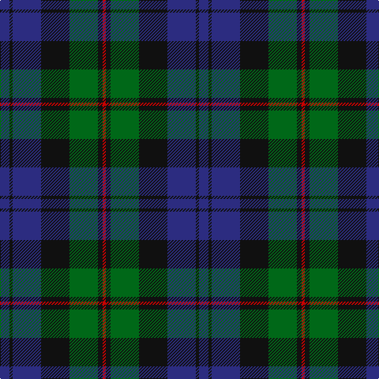

The parent of this is [Renfrew](/tartans/db/12/k4/db36/k36/g36/k6/r/4/)

This was sourced from register-of-tartans.  It is a [7 stripes tartan](/stripes/stripes7/).

Original link https://www.tartanregister.gov.uk/tartanDetails.aspx?ref=3498

## Thread count
DB/12 K4 DB36 K36 G36 K6 R/4

## Palette
Each colour and its ΔE from the base-6 reference it is a variant of.

| Colour | Shade | Base | ΔE (OKLab) |
|---|---|---|---|
| DB |  `#2C2C80` | B  | 0.05 |
| G |  `#006818` | G  | 0.02 |
| K |  `#101010` | K  | 0.17 |
| R |  `#C80000` | R  | 0.00 |

# Sample pattern

ID: /variants/db/12/k4/db36/k36/g36/k6/r/4-db2c2c80-g006818-k101010-rc80000/
