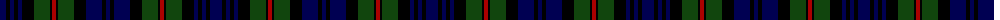

The parent of this is [MacKinlay](/tartans/db/12/k4/db4/k4/db4/k12/dg16/k2/dr4/k2/dg16/k12/db16/k4/db/4/)

This was sourced from weddslist.  It is a [15 stripes tartan](/stripes/stripes15/).

Original link http://www.weddslist.com/cgi-bin/tartans/pg.pl?source=x

## Thread count
DB/12 K4 DB4 K4 DB4 K12 DG16 K2 DR4 K2 DG16 K12 DB16 K4 DB/4

## Palette
Each colour and its ΔE from the base-6 reference it is a variant of.

| Colour | Shade | Base | ΔE (OKLab) |
|---|---|---|---|
| DB |  `#000052` | B  | 0.20 |
| DG |  `#11450D` | G  | 0.10 |
| DR |  `#AA0000` | R  | 0.06 |
| K |  `#000000` | K  | 0.00 |

ID: /variants/db/12/k4/db4/k4/db4/k12/dg16/k2/dr4/k2/dg16/k12/db16/k4/db/4-db000052-dg11450d-draa0000-k000000/
