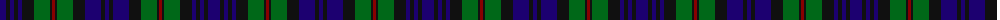

The parent of this is [MacKinlay (2/4 black stripes)](/tartans/db/12/k4/db4/k4/db4/k12/g16/k2/dr3/k2/g16/k12/db16/k4/db/4/)

This was sourced from register-of-tartans.  It is a [15 stripes tartan](/stripes/stripes15/).

Original link https://www.tartanregister.gov.uk/tartanDetails.aspx?ref=5201

## Thread count
DB/12 K4 DB4 K4 DB4 K12 G16 K2 DR3 K2 G16 K12 DB16 K4 DB/4

## Palette
Each colour and its ΔE from the base-6 reference it is a variant of.

| Colour | Shade | Base | ΔE (OKLab) |
|---|---|---|---|
| DB |  `#1C0070` | B  | 0.14 |
| DR |  `#880000` | R  | 0.14 |
| G |  `#006818` | G  | 0.02 |
| K |  `#101010` | K  | 0.17 |

ID: /variants/db/12/k4/db4/k4/db4/k12/g16/k2/dr3/k2/g16/k12/db16/k4/db/4-db1c0070-dr880000-g006818-k101010/
