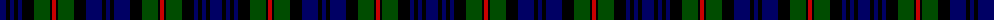

The parent of this is [MacKinlay](/tartans/db/12/k4/db4/k4/db4/k12/g16/k2/r4/k2/g16/k12/db16/k4/db/4/)

This was sourced from weddslist.  It is a [15 stripes tartan](/stripes/stripes15/).

Original link http://www.weddslist.com/cgi-bin/tartans/pg.pl?source=rb

## Thread count
DB/12 K4 DB4 K4 DB4 K12 G16 K2 R4 K2 G16 K12 DB16 K4 DB/4

## Palette
Each colour and its ΔE from the base-6 reference it is a variant of.

| Colour | Shade | Base | ΔE (OKLab) |
|---|---|---|---|
| DB |  `#000064` | B  | 0.17 |
| G |  `#004C00` | G  | 0.08 |
| K |  `#000000` | K  | 0.00 |
| R |  `#C80000` | R  | 0.00 |

ID: /variants/db/12/k4/db4/k4/db4/k12/g16/k2/r4/k2/g16/k12/db16/k4/db/4-db000064-g004c00-k000000-rc80000/
